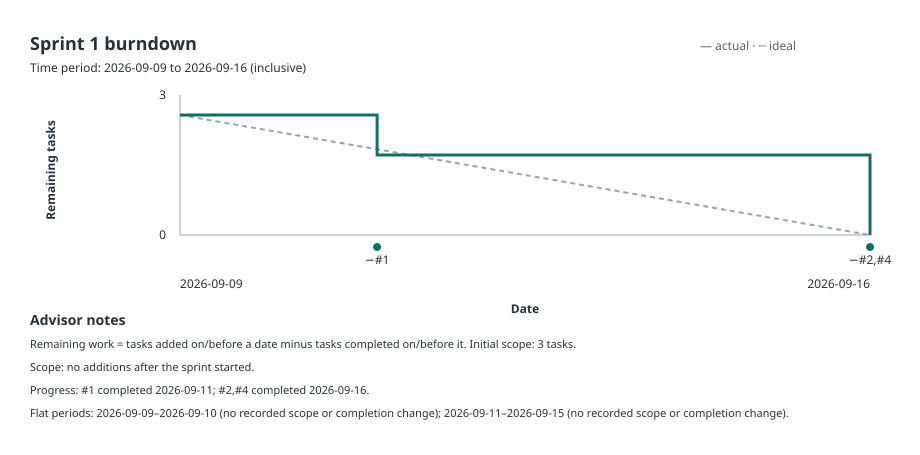

# Agile

This directory is the project record for product and sprint work. Before starting scoped work, agents must read the [Product Backlog](PRODUCT_BACKLOG.md) and the relevant sprint's `GOAL.md` and `BACKLOG.md`, then explicitly acknowledge that review in their first task update.

When a task changes state, scope, maintainer, or sprint, update its matching product-backlog and sprint-backlog rows in the same change. Update the sprint goal when the task changes the sprint objective. 

## Burndown chart

Run `npm run agile:burndown` before submitting every sprint, and commit the regenerated `BURNDOWN.svg` with those changes. The generator reads the Product Backlog for each task's current sprint, every sprint `GOAL.md` for `Start` and `End` dates, and every sprint `BACKLOG.md` for task state plus its `Added` and `Completed` dates.

`Added` and `Completed` must be dates (`YYYY-MM-DD`) within that sprint. A blank `Added` means initial sprint scope on the start date; record the actual date for work added later. A task counts as remaining from its added date through the day before its completed date, regardless of status text; leave `Completed` blank for incomplete work. The product backlog is authoritative for current assignment, so every product item must appear in its assigned sprint backlog. An earlier, completed sprint entry for a carried task is allowed; the carried entry has its own state and completion date.

Only sprints with a recorded completion appear in the SVG, so unfinished Sprint 2 work is retained and validated without appearing in the chart. The chart labels both axes and its inclusive time period. Advisor notes explain the remaining-work calculation, recorded scope increases, completed tasks, and flat periods with no recorded scope or completion change. The generator rejects malformed dates, unknown or duplicate task IDs, dates outside a sprint, completion before addition, and missing product-assigned sprint entries. It uses task count rather than timesheet hours; timesheets are not chart inputs.
